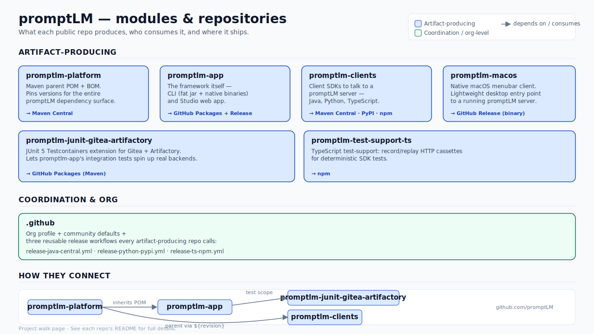
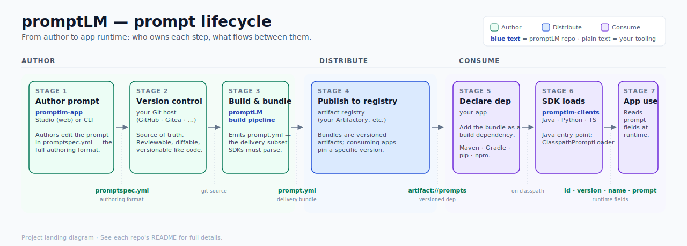

# promptLM / .github

Org-wide GitHub assets for the [promptLM](https://github.com/promptLM)
organization: reusable workflows, org-default community files
(`profile/README.md`), and config templates referenced by every other repo.

## Project at a glance

**Modules and repositories** — what each public repo produces and how they depend on each other.

**Prompt lifecycle** — how a prompt gets from an author into a running app.

## Reusable workflows

Live at `promptLM/.github/.github/workflows/<name>.yml@main`. Callers `uses:`
them with `secrets: inherit` (Java) or no secrets (Python/TS use OIDC).

| Workflow | Used by | Purpose |
|---|---|---|
| [`release-java-central.yml`](.github/workflows/release-java-central.yml) | every Java repo publishing to Maven Central | five-job topology: validate → verify → smoke-sign → deploy → promote |
| [`release-python-pypi.yml`](.github/workflows/release-python-pypi.yml) | Python publishers | OIDC trusted-publisher, no token, no GPG |
| [`release-ts-npm.yml`](.github/workflows/release-ts-npm.yml) | npm publishers | OIDC trusted-publisher + provenance |
| [`oss-checks.yml`](.github/workflows/oss-checks.yml) | every public repo | gitleaks secret scan + optional license-header check |

Design rationale and the full release-train topology live in
[`promptLM/promptlm-release`](https://github.com/promptLM/promptlm-release)
under `docs/ci-workflow-design.md`.

## Templates (copy-paste references)

These are not consumed at build time — copy them into each repo and trim to
fit. They live here so the canonical version is one place.

| Template | Drop into | Notes |
|---|---|---|
| [`dependabot.template.yml`](dependabot.template.yml) | `.github/dependabot.yml` | All ecosystems commented; keep what applies per repo |
| [`.licenserc.template.yaml`](.licenserc.template.yaml) | `.licenserc.yaml` | Apache-2.0 header for Java/TS/TSX/Py/sh; enforced by `oss-checks.yml` |

## Profile

[`profile/README.md`](profile/README.md) is rendered at the top of the
[organization page](https://github.com/promptLM) for unauthenticated visitors.
